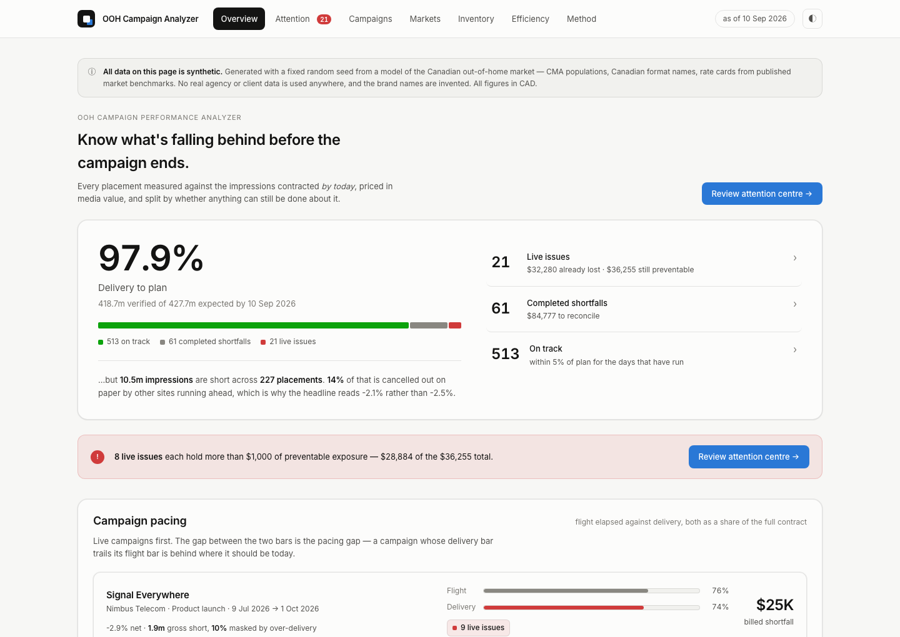
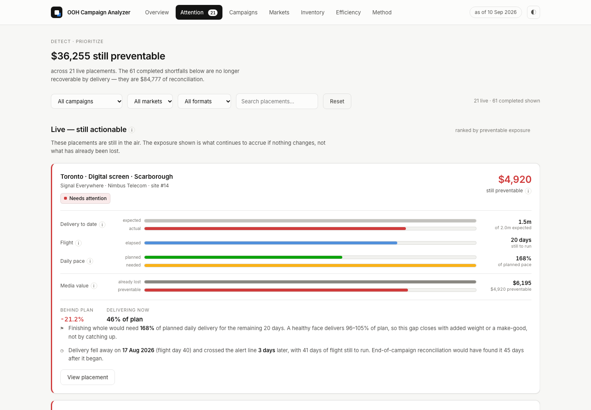
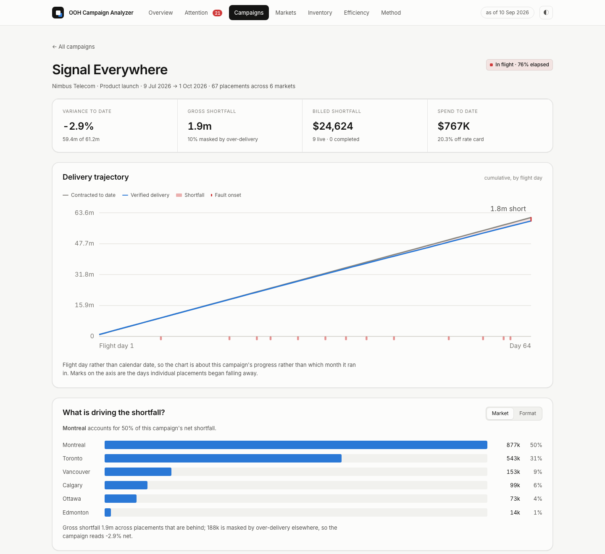
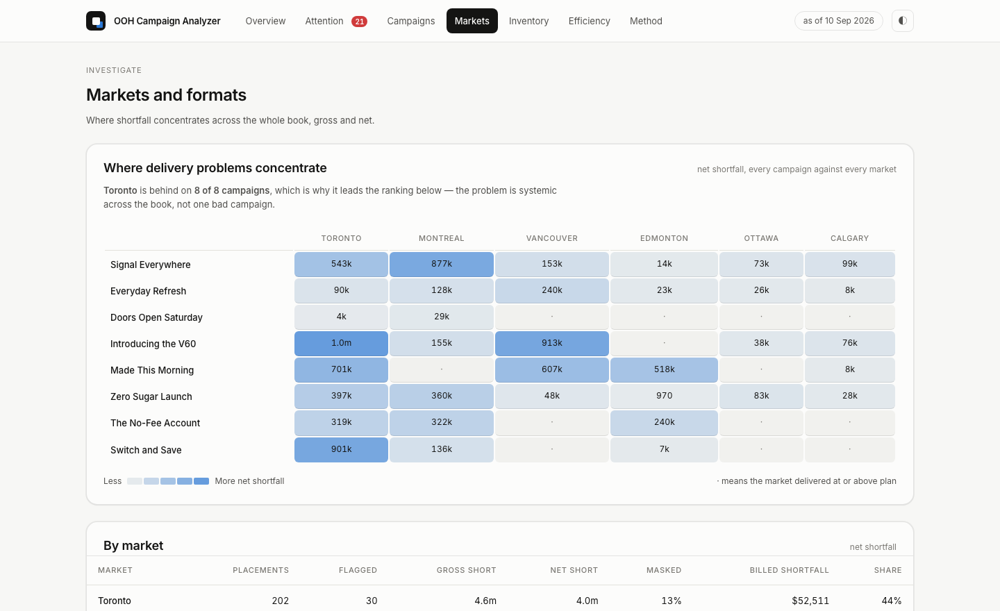
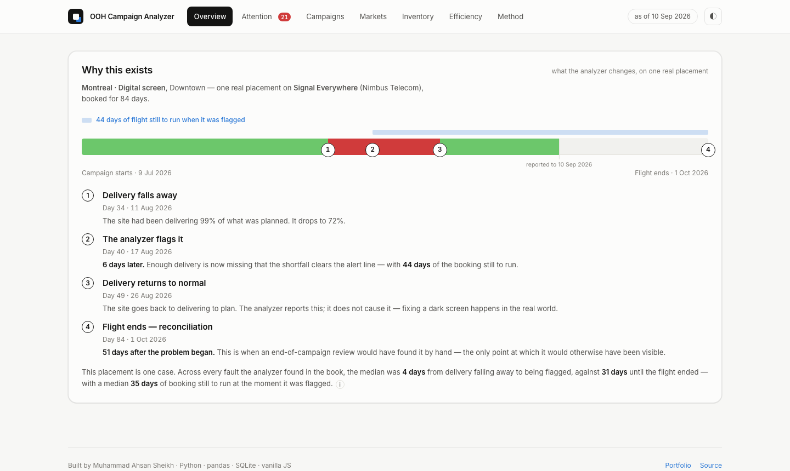
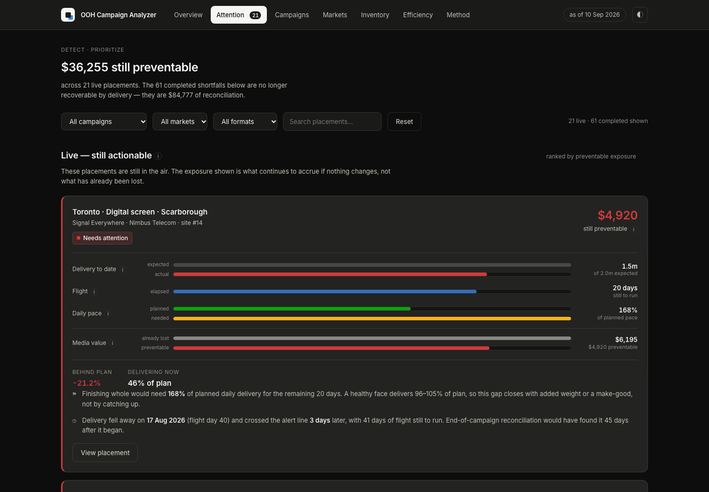

# OOH Campaign Performance Analyzer

**An out-of-home campaign performance analyzer that measures every placement against the
impressions contracted by today, surfaces under-delivery that campaign-level reporting
hides, prices it in media value, and separates what can still be fixed in flight from
what has to be reconciled after it.**

**[▶ Open the live dashboard](https://muhammadahsan-30.github.io/analyzer/)** — no install,
opens in the browser. All data is synthetic.

Built by [Muhammad Ahsan Sheikh](https://muhammadahsan-30.github.io), Honours Mathematics
and Business Administration (Co-op) at the University of Waterloo, after five months
inside a WPP/GroupM out-of-home agency doing campaign reconciliation by hand.



---

## The problem

Out-of-home advertising is billed against *estimated* impressions. A bulletin cannot
count who saw it, so the number comes from a traffic count times a visibility factor.
When a site goes dark, a poster tears, or a digital screen drops offline, real delivery
falls below what was contracted — and three things make that hard to see.

**A campaign can look healthy while individual placements are badly behind.** Campaign
reporting aggregates. One number for sixty placements hides the six that are failing.

**Over-delivery masks under-delivery.** Campaign variance nets the two against each
other. Sites running hot cancel out sites running dark on paper, even though over-delivery
in Calgary does not repair a dark screen in Montreal — the advertiser still did not get
what they bought, where they bought it.

**Reconciliation happens after the opportunity to act has passed.** Agencies normally
find these gaps by hand at end of campaign, weeks after the money is spent and the
flight is over.

## What the analyzer does

- **Measures each placement against the delivery contracted *by today*** — contracted
  impressions prorated to the days that have actually run, so a live campaign is judged
  on its elapsed days instead of being penalised for days that have not happened yet.
- **Detects under-delivery during active flights**, from the daily delivery record, and
  reports how many days of flight remain to act in.
- **Quantifies gross and net shortfall separately**, and measures how much of the gross
  figure is masked by over-delivery elsewhere.
- **Prices the shortfall in media value** at the rate the client agreed to pay per
  thousand — split into what has already been lost and what is still preventable.
- **Separates live issues from completed reconciliation cases.** A placement still in
  the air is a phone call; a closed one is a credit conversation. They are ranked by
  different measures and presented differently.
- **Drills down** from portfolio to campaign to market, format, and individual placement.

### A short glossary, for readers who know campaigns but not Python

| Term | Meaning |
|---|---|
| **Flight** | The booked run of a campaign or placement, from start date to end date |
| **Placement** | One advertising site booked for one campaign over one date window |
| **Contracted to date** | The impressions owed *so far*, prorated to the days elapsed |
| **Verified delivery** | What the site actually delivered over the same days |
| **Gross shortfall** | Impressions missing, counting only placements that are behind |
| **Net shortfall** | Gross shortfall after over-delivering placements are subtracted |
| **Masking** | The share of gross shortfall cancelled out by over-delivery elsewhere |
| **Media-value exposure** | The shortfall priced in dollars at the contracted CPM. Two named measures: *flagged* covers the 82 placements past the −5% line, *total negative* covers all 227 behind by any amount. They are never interchanged |
| **Live issue** | A flagged placement still in flight — there is still time to act |
| **Reconciliation** | A flagged placement whose flight has closed — make-good or credit |

---

## Gross against net shortfall: the number campaign reporting hides

This is the clearest thing the analyzer does, and it needs no code to explain.

Take **Doors Open Saturday**, a live retail campaign in the bundled dataset. Campaign
reporting shows it essentially perfect:

| | |
|---|---|
| **Campaign-level variance** | **−0.1%** — on plan |
| **Placements behind plan** | **27 of 70** |
| **Gross shortfall** | **106,841 impressions** |
| **Masked by over-delivery elsewhere** | **81%** |

The campaign reads −0.1% because sites running ahead cancel out sites running behind.
Underneath that single number, 27 placements are short, and four fifths of the gap is
hidden by the netting. A marketer reading only the campaign number would see nothing to
investigate.

Across the whole book the same effect holds at a smaller scale: the portfolio reads
**−2.1%**, while **10.5m impressions** are short across **227 placements**, with **14%**
of that masked.

Both numbers are reported everywhere in the product, because they answer different
questions. Gross is the operational figure. Net is the accounting figure.

---

## What the synthetic evaluation demonstrates

Delivery faults in the synthetic data begin on a **day** — a site goes dark partway
through a flight, and sometimes gets repaired. That makes "caught early" a measurable
quantity rather than a claim.

The analyzer finds faults from the daily delivery series alone. It is never shown the
generator's fault log.

| Measure | Result |
|---|---|
| Faults generated | 119, of which **104 began** inside the reported window |
| Faults recovered from delivery data alone | **102 — 98.1%** |
| Median error in the inferred fault start date | **0 days** |
| Median delay from fault onset to crossing the −5% alert line | **4 days** |
| Median delay from fault onset to end of flight | **31 days** |
| Median flight remaining when a placement was flagged | **35 days** |
| Faults repaired mid-flight | 32 |

A cumulative read is held until **14 days** of delivery have run. Without that guard the
alert fires on 45 placements that never developed a fault, and 15 detection delays come
out negative — the "cumulative" variance on day one *is* a single day, and a healthy day
sits as low as 92% of plan. Documented in [docs/assumptions.md](docs/assumptions.md).

The gap between **4 days** and **31 days** is the entire argument for the tool. The
second number is when an end-of-campaign reconciliation would have found the same fault
by hand.

> **These figures come from a deterministic synthetic campaign environment**, not from
> real campaigns or industry data. They demonstrate that the system's central claim is
> measurable and that the detection method works against known ground truth — not that
> any particular detection rate would hold on real inventory. Real OOH campaigns do not
> come with fault labels, which is precisely why the detector is built to work without
> them.

### Portfolio results on the bundled dataset

120 sites, 8 national campaigns (five closed, **three still in flight**), 595 placements,
27,414 daily delivery records, measured as of 2026-09-10:

| Measure | Value |
|---|---|
| Delivery to plan | 97.9% — 418.7m verified of 427.7m contracted to date |
| Gross shortfall | 10.5m impressions across 227 placements, **14% masked** |
| Placements flagged below −5% | 82 (13.8%) — **21 live**, 61 completed |
| Flagged media-value exposure | CAD 117,058 across the 82 flagged (CAD 32,280 live · CAD 84,777 to reconcile) |
| Total negative delivery exposure | CAD 134,655 across all 227 placements behind by any amount |
| Still preventable on live placements | CAD 36,255, of which CAD 28,884 sits in 8 issues |
| Spend billed to date | CAD 5.41m |
| Blended CPM | CAD 12.92 on verified delivery |
| Negotiated off rate card | 20.0%, spend-weighted |

---

## The interface

**Attention Centre** — live issues as cards ranked by *preventable* exposure, completed
shortfalls as a reconciliation table. Different components because they are different
jobs: a card has room for the sentence telling you what acting would mean, a table row
has the aligned precision a credit conversation needs.



**Campaign drill-down** — pacing, a flight-day delivery trajectory with fault onsets
marked on the axis, a gross-to-net waterfall, and what is driving the shortfall by market,
format and placement.



**Markets** — a campaign × market heatmap answering a question ranked bars cannot: is a
market behind *everywhere*, or behind on one campaign? Toronto is behind on 8 of 8.

Seven views in all: Overview, Attention Centre, Campaigns, Markets, Inventory,
Efficiency and Method. Light and dark themes, both designed rather than inverted, with
the theme choice persisted. The status palette is validated for colour-vision deficiency
and every status is a glyph plus a word, never colour alone.



**The flight timeline** explains what the product is for, using one real placement's
delivery history rather than an illustration — a Montreal digital screen that ran at 99%
of plan, fell to 72% on day 34, was flagged on day 40 with 44 days of booking still to
run, and returned to normal on day 49. An end-of-campaign reconciliation would not have
found it until day 84.



Every figure a general reader might not know carries an **i** affordance — click or
keyboard — giving a one-sentence plain-English reading and a route into the methodology.
"Media-value exposure", for instance, explains that it is exposure, *not* automatically a
refund or a loss.



---

## How it is built

```
  src/generate_data.py          synthetic campaign generator, fixed seed (42)
            │                   faults have onset dates and sometimes repair
            ▼
  data/ooh.db                   SQLite — 4 normalised tables, enforced foreign keys
            │
            ▼
  src/metrics.py                every business calculation, one function each,
            │                   unit-tested on hand-verifiable inputs
            ▼
  src/export_json.py            runs the metrics, VALIDATES, writes the payload
            │                   (refuses to write if elapsed days disagree with
            │                    the delivery rows the database holds)
            ▼
  public/data.json + data.js    static JSON — every number already computed
            │
            ▼
  public/index.html + app.js    presentation-only browser UI
                                no framework, no chart library, no build step
```

### Python computes; the browser renders

This is the architectural rule the project is organised around. **Every business
calculation lives in `src/metrics.py`** — prorated variance, gross and net shortfall,
spend to date, media-value exposure, recovery pace, fault detection, CPM, rate
efficiency, reach and frequency. Each function does one thing and is covered by unit
tests on inputs small enough to check by hand.

`public/app.js` does not recreate any of them. It formats numbers, lays out charts, and
handles interaction — nothing else. There is therefore exactly one definition of every
figure in the product, and it is the one the tests cover. The standalone SQL in
`src/queries.sql` independently reproduces the spend figure to the dollar, as a
cross-check on the Python.

The charts are hand-built SVG and CSS rather than a charting library, which keeps the
payload small and gives exact control over the mark specifications the design system
sets.

### Power BI companion — model prepared, report authoring pending

A BI export layer ships alongside the dashboard: `bi/` holds a six-table star schema
(three dimensions, three facts) written by `src/export_bi.py` from the same database and
the same `metrics.py` functions the web app uses, so both surfaces are fed by one pipeline
and one set of definitions.

`src/validate_bi.py` reproduces ten business metrics independently in Python and SQL and
writes `bi/validation_expected.csv` with the value each DAX measure must return, the
population it covers, and a tolerance. **No Power BI report exists yet** — the semantic
model, DAX, page design and build steps are specified in `docs/`, and the report will be
authored in Power BI Service.

Sequential logic — fault onset, alert crossing, recovery runs, detection delay — stays
precomputed in Python and is exported as facts. Only additive and ratio measures are
reproduced in DAX. The generator's fault plan is evaluation-only and is never exported.

```
src/generate_data.py   synthetic data -> SQLite, fixed seed; faults have onset dates
src/schema.sql         4 tables (sites, campaigns, placements, delivery), foreign keys
src/metrics.py         every metric, one function each, all unit-tested
src/export_json.py     runs the metrics, validates, writes public/data.{json,js}
src/queries.sql        standalone analytical SQL (CTEs, ROW_NUMBER / LAG window functions)
src/export_bi.py       star-schema CSVs for the Power BI companion
src/validate_bi.py     Python / SQL cross-validation -> bi/validation_expected.csv
bi/                    six BI tables + the validation table
public/                static dashboard — no server, no build step, no framework
tests/test_metrics.py  41 tests on hand-verifiable inputs
docs/assumptions.md    every modelling assumption, written down
docs/product-audit.md  why each component exists, and why several were cut
docs/design-spec.md    the visual specification the interface implements
```

## How to run it

Python 3.10+, two dependencies. From a fresh clone:

```bash
git clone https://github.com/muhammadahsan-30/ooh-campaign-analyzer
cd ooh-campaign-analyzer
pip install -r requirements.txt          # pandas, pytest
python src/generate_data.py              # builds data/ooh.db (fixed seed, reproducible)
python src/export_json.py                # writes public/data.json and public/data.js
python -m pytest tests/ -q               # 41 tests
cd public && python -m http.server 8000  # open http://localhost:8000
```

If SQLite cannot take file locks (network drives, some mounts), point the database
elsewhere: `OOH_DB=/tmp/ooh.db python src/generate_data.py` (`export_json.py` honours
it too).

---

## Limitations, stated plainly

**All data is synthetic.** It is generated from a model of the Canadian OOH market — CMA
populations, Canadian format names, rate cards from published market benchmarks — with a
fixed random seed. All figures are CAD. No real agency or client data is used anywhere
and the brand names are invented.

- **No calibrated digital share-of-loop model.** A digital face rotates in a shared loop,
  so its impressions are a share of loop time rather than the exclusive presence a static
  bulletin holds. The model does not represent this, so digital and static CPM are **not
  ranked against each other** — static formats are compared among themselves and digital
  is reported separately. The CPM premium (delivered against contracted CPM) *is*
  comparable across formats, because it is a within-format ratio.
- **No end-of-flight forecasting.** Preventable exposure extends the *current* delivery
  rate across the remaining flight and is labelled modelled wherever it appears. It is
  not a prediction of where a campaign lands, and no projection line is drawn on any
  chart.
- **No persistent site-quality model.** The inventory view therefore reports a null
  result rather than a ranking: 12 sites were flagged on two or more campaigns, against
  **17.2 expected by chance alone** at the overall flag rate. There is no site-level
  signal in this data, and the view says so.
- **Reach and frequency are modelled, not observed.** Gross impressions count exposures,
  not people; converting them uses a saturation curve with `p = 0.35`, a planning
  convention rather than a measured value. Cross-market duplication is not removed, so
  national reach is an upper bound.
- **Media-value exposure is exposure, not a refund forecast.** It makes no distinction
  between make-goods and cash credits, and some of it would be recovered by a site
  catching up before the flight closes.
- **Fault detection is a stated rule, not a learned model** — three consecutive days
  below 90% of planned daily delivery. It is explainable out loud, which is the point.
- **Impressions are estimated, never counted**, which is true of all out-of-home
  reporting. Contracted impressions are `daily_traffic × visibility_factor × days`.

Every modelling assumption is documented in [docs/assumptions.md](docs/assumptions.md),
along with what the tool deliberately does not do.

## What I would add next

- A share-of-loop model for digital faces, so digital and static CPM become comparable.
  Done properly it cuts digital impressions ~6–8× and needs the digital rate card
  recalibrated in the same change, which is why it is documented rather than patched
- Persistent site quality in the generator, so inventory reliability becomes a real
  signal rather than the honest null it currently reports
- A delivery curve instead of straight-line proration, so weekday/weekend and seasonal
  weighting are respected rather than assumed flat
- A threshold that widens when few days have elapsed — the −5% line is a hard cliff, and
  early in a flight daily noise has not averaged out
- Attribution: join sales data to exposure windows for a real return-on-ad-spend figure
- Extend to 10–12 CMAs, so the heaviest campaign stops saturating the Toronto reach curve
